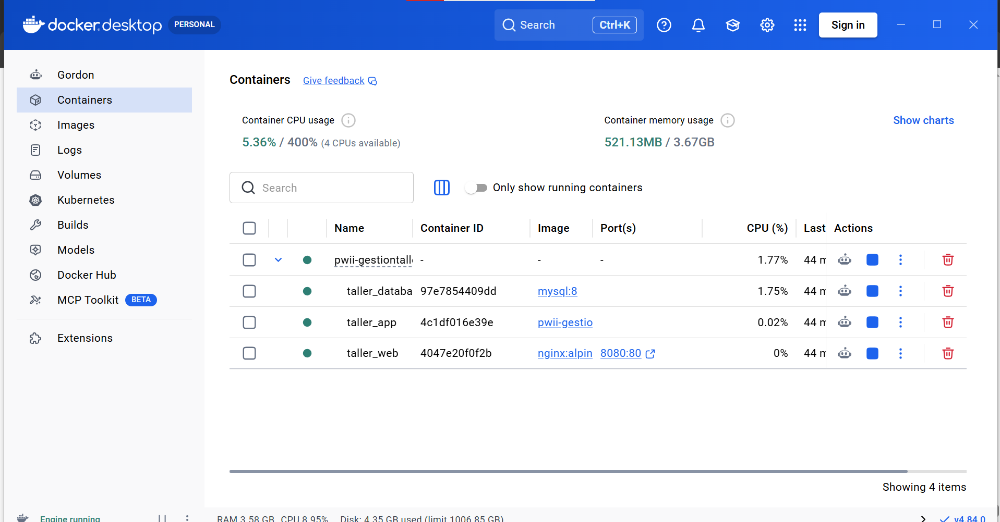
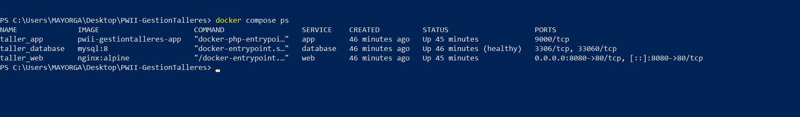
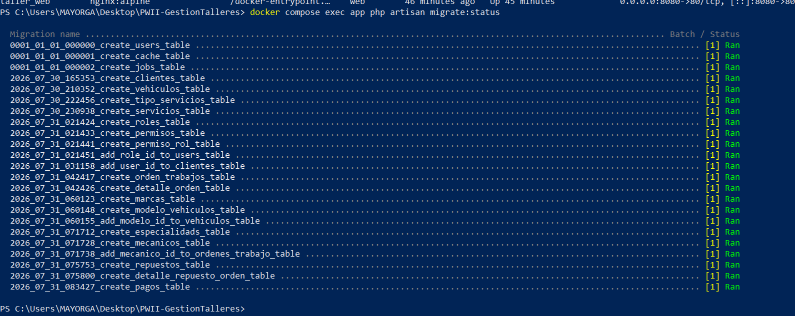
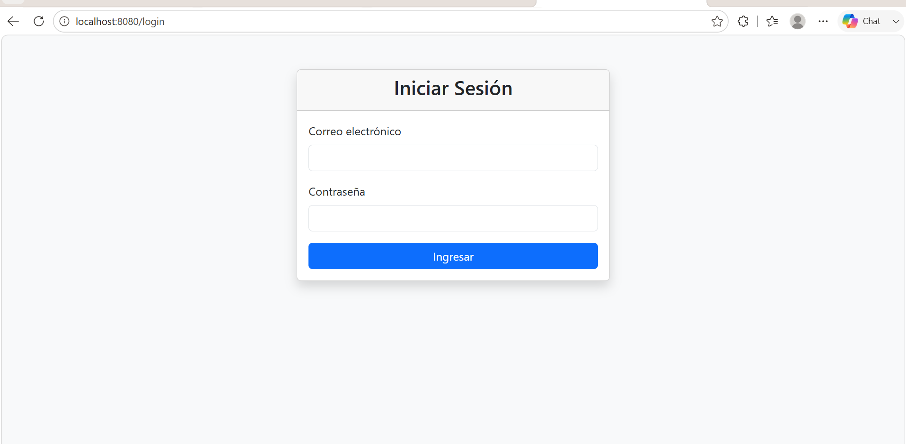
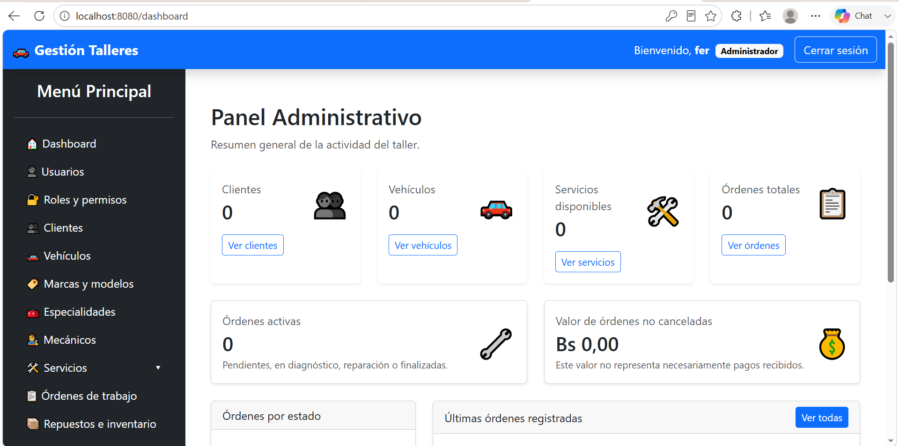
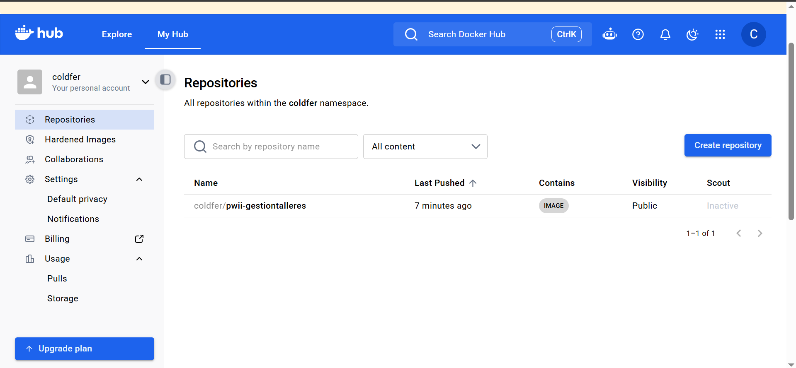
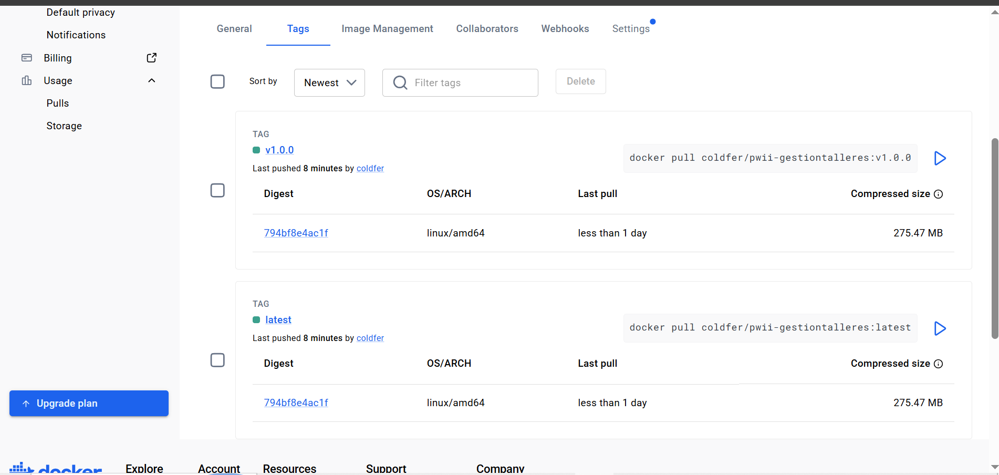
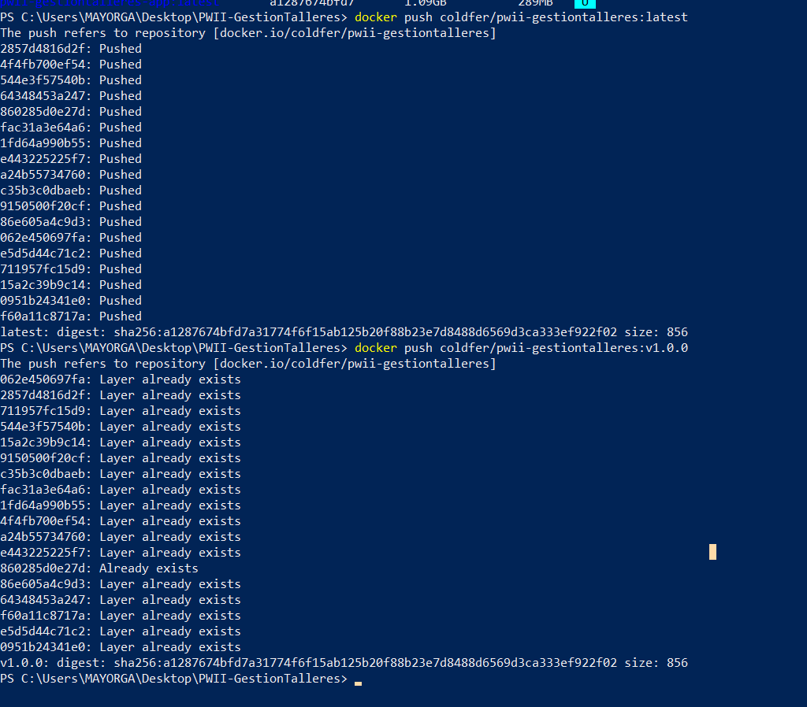

# Sistema de Gestión de Talleres Automotrices

<p align="center">
  <a href="https://youtu.be/kHuLrivZ1uQ">
    
  </a>
</p>

<h2 align="center">🎥 Video de presentación y defensa</h2>

<p align="center">
  <strong>Conoce el funcionamiento, las tecnologías, la contenerización y el despliegue del sistema.</strong>
</p>

<p align="center">
  ▶️ <a href="https://youtu.be/kHuLrivZ1uQ"><strong>Ver demostración completa en YouTube</strong></a>
</p>

---

Aplicación web desarrollada en **Laravel** para administrar los procesos principales de un taller automotriz.

El sistema permite gestionar usuarios, clientes, vehículos, servicios, órdenes de trabajo, mecánicos, repuestos, inventario, pagos y reportes.

El proyecto fue contenerizado con Docker utilizando tres servicios principales:

- Laravel con PHP-FPM 8.4
- Nginx
- MySQL 8

## Aplicación publicada

La aplicación se encuentra desplegada públicamente en Railway:

https://pwii-gestiontalleres-production.up.railway.app

## Repositorios

### GitHub

https://github.com/ColdFer/PWII-GestionTalleres

### Docker Hub

https://hub.docker.com/r/coldfer/pwii-gestiontalleres

### Etiquetas publicadas en Docker Hub

https://hub.docker.com/r/coldfer/pwii-gestiontalleres/tags

## Imagen Docker

Imagen más reciente:

```bash
docker pull coldfer/pwii-gestiontalleres:latest
```

Versión estable actual:

```bash
docker pull coldfer/pwii-gestiontalleres:v1.0.1
```

Versión inicial:

```bash
docker pull coldfer/pwii-gestiontalleres:v1.0.0
```

Las etiquetas `latest` y `v1.0.1` corresponden actualmente a la misma imagen.

Digest de la versión publicada:

```text
sha256:84ca42f7e7a49b4555c75aa83f5a760e0d53f58bd516529cc1164c3f1e3e2abd
```

## Tecnologías utilizadas

- Laravel 13
- PHP 8.4
- Blade
- Bootstrap
- JavaScript
- Vite
- MySQL 8
- Nginx
- Docker
- Docker Compose
- Railway
- Git
- GitHub
- Docker Hub

## Módulos principales

- Autenticación manual
- Roles y permisos
- Gestión de usuarios
- Gestión de clientes
- Gestión de vehículos
- Marcas y modelos
- Tipos de servicio
- Servicios
- Órdenes de trabajo
- Asignación de mecánicos
- Especialidades
- Repuestos e inventario
- Pagos
- Reportes
- Panel de administración
- Portal del cliente

## Arquitectura Docker

```text
Navegador
    ↓
http://localhost:8080
    ↓
Nginx — puerto 80
    ↓
app:9000
    ↓
PHP-FPM + Laravel
    ↓
database:3306
    ↓
MySQL
```

Los servicios definidos en `compose.yml` son:

- `app`: ejecuta Laravel con PHP-FPM.
- `web`: ejecuta Nginx y publica el sistema en el puerto 8080.
- `database`: ejecuta MySQL y almacena los datos en un volumen persistente.

## Despliegue en Railway

La aplicación está disponible públicamente en:

https://pwii-gestiontalleres-production.up.railway.app

Railway construye la aplicación utilizando el `Dockerfile` del proyecto.

La base de datos MySQL se ejecuta como un servicio administrado dentro del mismo proyecto de Railway.

El archivo `railway.toml` contiene la configuración necesaria para:

- Construir la aplicación mediante el `Dockerfile`.
- Ejecutar las migraciones pendientes.
- Iniciar Laravel en el puerto 8080.
- Comprobar el funcionamiento mediante la ruta `/up`.
- Reiniciar la aplicación si ocurre un fallo.

Configuración utilizada:

```toml
[build]
builder = "DOCKERFILE"
dockerfilePath = "Dockerfile"

[deploy]
preDeployCommand = ["php artisan migrate --force"]
startCommand = "php artisan serve --host=0.0.0.0 --port=8080"
healthcheckPath = "/up"
healthcheckTimeout = 300
restartPolicyType = "ON_FAILURE"
restartPolicyMaxRetries = 3
```

Variables generales de producción:

```env
APP_ENV=production
APP_DEBUG=false
APP_URL=https://pwii-gestiontalleres-production.up.railway.app
ASSET_URL=https://pwii-gestiontalleres-production.up.railway.app
PORT=8080

SESSION_DRIVER=database
SESSION_SECURE_COOKIE=true
SESSION_SAME_SITE=lax

LOG_CHANNEL=stderr
```

Las credenciales de MySQL, contraseñas y claves privadas se configuran directamente en Railway y no se publican en GitHub.

## Requisitos

- Docker Desktop
- Docker Compose
- Git

Comprobar Docker:

```bash
docker version
docker compose version
docker run --rm hello-world
```

## Instalación con Docker

### 1. Clonar el repositorio

```bash
git clone https://github.com/ColdFer/PWII-GestionTalleres.git
cd PWII-GestionTalleres
```

### 2. Crear el archivo `.env`

En Windows PowerShell:

```powershell
Copy-Item .env.example .env
```

En Linux o macOS:

```bash
cp .env.example .env
```

### 3. Configurar la base de datos

Editar el archivo `.env`:

```env
APP_NAME="Sistema de Gestión de Talleres"
APP_ENV=local
APP_KEY=
APP_DEBUG=true
APP_URL=http://localhost:8080

DB_CONNECTION=mysql
DB_HOST=database
DB_PORT=3306
DB_DATABASE=gestion_talleres
DB_USERNAME=taller_user
DB_PASSWORD=colocar_contrasena

SESSION_DRIVER=database
CACHE_STORE=database
QUEUE_CONNECTION=database
```

Dentro de Docker debe utilizarse:

```env
DB_HOST=database
```

No debe utilizarse `localhost` ni `127.0.0.1`, porque MySQL se ejecuta en otro contenedor.

### 4. Configurar el administrador inicial

```env
ADMIN_NAME="Administrador del Taller"
ADMIN_EMAIL=admin@taller.com
ADMIN_PASSWORD=colocar_contrasena_segura
```

### 5. Construir las imágenes

```bash
docker compose build
```

También puede construirse y levantarse el proyecto mediante:

```bash
docker compose up -d --build
```

### 6. Levantar los servicios

```bash
docker compose up -d
```

### 7. Verificar los contenedores

```bash
docker compose ps
```

Deben aparecer:

```text
taller_app
taller_web
taller_database
```

### 8. Generar la clave de Laravel

Ejecutar solamente cuando `APP_KEY` esté vacío:

```bash
docker compose exec app php artisan key:generate
```

### 9. Ejecutar migraciones y seeders

```bash
docker compose exec app php artisan migrate --seed
```

Este comando crea las tablas, registra los roles y permisos y crea el administrador inicial.

### 10. Limpiar las cachés

```bash
docker compose exec app php artisan optimize:clear
```

### 11. Abrir la aplicación

```text
http://localhost:8080
```

## Comandos útiles

Ver contenedores:

```bash
docker compose ps
```

Ver logs:

```bash
docker compose logs --tail=100
```

Ver logs de Laravel:

```bash
docker compose logs app
```

Ver logs de Nginx:

```bash
docker compose logs web
```

Ver logs de MySQL:

```bash
docker compose logs database
```

Consultar las migraciones:

```bash
docker compose exec app php artisan migrate:status
```

Limpiar las cachés:

```bash
docker compose exec app php artisan optimize:clear
```

Reiniciar los servicios:

```bash
docker compose restart
```

Detener los servicios:

```bash
docker compose down
```

Levantar nuevamente los servicios:

```bash
docker compose up -d
```

Reconstruir la aplicación:

```bash
docker compose build app
```

## Comprobación de la imagen publicada

Descargar la versión estable:

```bash
docker pull coldfer/pwii-gestiontalleres:v1.0.1
```

Descargar la versión más reciente:

```bash
docker pull coldfer/pwii-gestiontalleres:latest
```

Comprobar las imágenes disponibles:

```bash
docker image ls coldfer/pwii-gestiontalleres
```

Comprobar la versión de PHP incluida:

```bash
docker run --rm coldfer/pwii-gestiontalleres:v1.0.1 php -v
```

Comprobar la versión de Laravel:

```bash
docker run --rm coldfer/pwii-gestiontalleres:v1.0.1 php artisan --version
```

La imagen publicada contiene Laravel con PHP-FPM. Para ejecutar el sistema completo localmente también se necesitan los servicios Nginx y MySQL definidos en `compose.yml`.

## Evidencias de Docker

### Docker Desktop funcionando



### Contenedores activos



### Migraciones ejecutadas



### Pantalla de inicio de sesión



### Panel de administración



### Repositorio publicado en Docker Hub



### Etiquetas publicadas en Docker Hub



### Publicación de la imagen Docker



## Estructura Docker

```text
PWII-GestionTalleres/
├── Dockerfile
├── compose.yml
├── railway.toml
├── .dockerignore
├── docker/
│   └── nginx/
│       └── default.conf
├── screenshots/
│   └── docker/
└── ...
```

## Seguridad

El archivo `.env` no debe publicarse en GitHub ni incluirse dentro de la imagen Docker.

Las contraseñas reales, credenciales de base de datos y claves privadas deben mantenerse fuera del repositorio mediante variables de entorno.

En producción se utiliza:

```env
APP_ENV=production
APP_DEBUG=false
```

Las contraseñas de los usuarios se almacenan mediante hash.

El sistema utiliza:

- Autenticación
- Roles y permisos
- Middleware
- Protección CSRF
- Validación de formularios
- Cookies seguras mediante HTTPS

No se debe ejecutar `php artisan migrate:fresh` en producción porque elimina todas las tablas y los datos.

## Autor

**David Fernando Mayorga Barco**

Proyecto desarrollado para la asignatura **Programación Web II**.